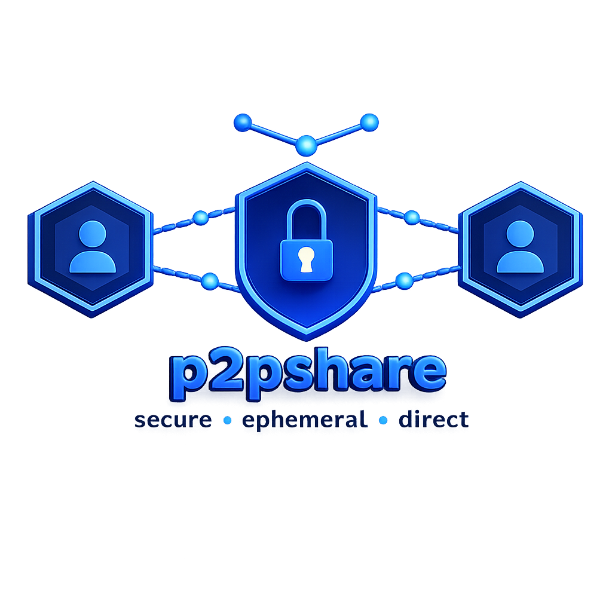

<p align="center">
  
</p>
<h1 align="center">Share files with Security written in Go</h1>

# p2pshare - P2P File Share with Security

> secure · ephemeral · direct · encrypted

P2P file transfer over a direct TCP connection. No broker, no relay, no stored keys. Every run generates a fresh ed25519 keypair; when the process exits, the keys are gone.

---

## ✨ Features

- 🔐 **Mutual authentication** — ed25519 signatures with challenge-response
- 🔒 **Encrypted channel** — X25519 ECDH + AES-256-GCM (hardware accelerated)
- 📦 **File integrity** — SHA-256 hash chain verification
- 📁 **Directory support** — Send entire directories (compressed as .tar.gz)
- 📊 **Progress bar** — Visual feedback during transfers
- ⏱️ **Configurable timeouts** — Handshake, read, write, idle
- 🔑 **PSK support** — Optional Pre-Shared Key for extra security
- 📝 **Structured logging** — JSON or human-readable format
- 🗜️ **Compression** — Optional gzip compression
- 📋 **Audit ledger** — Hash-chained transfer history

---

## 🔒 Security Model

Three independent layers protect every transfer.

1. **Mutual authentication** — both peers exchange ed25519 public keys and sign a shared challenge
2. **Encrypted channel** — X25519 ECDH + HKDF-SHA256 + AES-256-GCM
3. **File integrity** — SHA-256 hash chain with final signature

---

## 📦 Installation

```bash
git clone https://github.com/waldirborbajr/p2pshare
cd p2pshare
go build -o p2pshare .
```

---

## 🚀 Quick Start

### Receiver listens
```bash
./p2pshare -listen :4444 -recv
```

### Sender connects and sends file
```bash
./p2pshare -connect 192.168.1.10:4444 -send ./file.txt
```

---

## 🚀 Exemplos Práticos

### 1. Transferência Básica de Arquivo

**Receptor (escuta):**
```bash
./p2pshare -listen :4444 -recv
```

**Remetente (conecta e envia):**
```bash
./p2pshare -connect 192.168.1.10:4444 -send ./documento.pdf
```

---

### 2. Enviar um Diretório Inteiro

O diretório é automaticamente compactado em .tar.gz antes da transferência.

**Receptor:**
```bash
./p2pshare -listen :4444 -recv
```

**Remetente:**
```bash
./p2pshare -connect 192.168.1.10:4444 -send ./meu-projeto/
```

---

### 3. Receptor Envia, Conector Recebe (NAT)

Útil quando o remetente está atrás de NAT e o receptor tem IP público.

**Remetente (escuta com arquivo):**
```bash
./p2pshare -listen :4444 -send ./backup.tar.gz
```

**Receptor (conecta e recebe):**
```bash
./p2pshare -connect 200.100.50.10:4444 -recv
```

---

### 4. Com Compactação Ativada

Comprime o arquivo antes de enviar (útil para arquivos de texto ou dados compressíveis).

**Remetente:**
```bash
./p2pshare -connect 192.168.1.10:4444 -send ./log.txt -compress
```

---

### 5. Com Autenticação PSK (Pre-Shared Key)

Adiciona uma camada extra de segurança com senha pré-compartilhada.

**Receptor:**
```bash
./p2pshare -listen :4444 -recv -psk minhaSenhaSecreta
```

**Remetente:**
```bash
./p2pshare -connect 192.168.1.10:4444 -send ./arquivo.txt -psk minhaSenhaSecreta
```

---

### 6. Configurando Timeouts

Para redes lentas ou instáveis, aumente os timeouts.

**Receptor:**
```bash
./p2pshare -listen :4444 -recv -handshake-timeout 60s -read-timeout 120s -idle-timeout 5m
```

**Remetente:**
```bash
./p2pshare -connect 192.168.1.10:4444 -send ./video.mp4 -write-timeout 120s
```

---

### 7. Logs em Formato JSON

Para integração com ferramentas de monitoramento.

**Receptor:**
```bash
./p2pshare -listen :4444 -recv -log-json -log-level debug
```

---

### 8. Desabilitar Barra de Progresso

Para scripts ou automação.

**Remetente:**
```bash
./p2pshare -connect 192.168.1.10:4444 -send ./dados.csv -progress=false
```

---

### 9. Verificar Ledger de Transferências

Exibe o histórico de todas as transferências realizadas.

```bash
./p2pshare -ledger-show
```

---

### 10. Cenário Completo com Todas as Opções

**Receptor (com todas as opções):**
```bash
./p2pshare -listen :4444 -recv -psk minhaSenha -compress -log-json -progress -handshake-timeout 60s
```

**Remetente (com todas as opções):**
```bash
./p2pshare -connect 192.168.1.10:4444 -send ./diretorio/ -compress -psk minhaSenha -log-json -progress -write-timeout 120s
```

---

### 🧪 Teste Rápido (Localhost)

Para testar localmente, abra dois terminais:

**Terminal 1 (Receptor):**
```bash
./p2pshare -listen :4444 -recv
```

**Terminal 2 (Remetente):**
```bash
echo "Conteúdo de teste" > teste.txt
./p2pshare -connect localhost:4444 -send ./teste.txt
```

Após a transferência, o arquivo `teste.txt` aparecerá no diretório do receptor.

---

## ⚙️ Flags Reference

| Flag | Description | Default |
|:-----|:------------|:--------|
| `-listen <addr>` | Bind and accept one connection | - |
| `-connect <addr>` | Connect to a listening peer | - |
| `-send <path>` | File or directory to send | - |
| `-recv` | Receive a file | false |
| `-compress` | Compress file before sending (gzip) | false |
| `-psk <key>` | Pre-Shared Key for authentication | - |
| `-handshake-timeout <dur>` | Handshake timeout | 30s |
| `-read-timeout <dur>` | Read timeout | 60s |
| `-write-timeout <dur>` | Write timeout | 60s |
| `-idle-timeout <dur>` | Idle timeout | 2m |
| `-log-json` | JSON formatted logs | false |
| `-log-level <level>` | Log level (debug, info, warn, error) | info |
| `-progress` | Show progress bar | true |
| `-ledger-show` | Show transfer ledger | - |

---

## 🏗️ Architecture

```
p2pshare/
├── main.go          # Entry point, orchestration
├── config.go        # Configuration and flags
├── progress.go      # Progress bar
├── archive.go       # Directory support (tar.gz)
├── psk.go           # Pre-Shared Key authentication
├── logger.go        # Structured logging
└── compress.go      # Optional compression
```

---

## 🔧 Development

### Build

```bash
go build -o p2pshare .
```

### Run Tests

```bash
go test ./...
```

### Cross-compile

```bash
GOOS=linux GOARCH=amd64 go build -o p2pshare-linux-amd64 .
GOOS=darwin GOARCH=arm64 go build -o p2pshare-macos-arm64 .
GOOS=windows GOARCH=amd64 go build -o p2pshare-windows-amd64.exe .
```

---

## 🔒 Dicas de Segurança

1. **Use PSK** em redes não confiáveis para autenticação adicional.
2. **Verifique o ledger** periodicamente para auditoria: `./p2pshare -ledger-show`.
3. **Chaves efêmeras** são geradas a cada execução, garantindo perfect forward secrecy.
4. **Confie no peer** — não há verificação de identidade persistente (por design).

---

## 📝 Changelog

### v2.0.0 (2026-08-21)

**New Features:**
- 📁 Directory support (automatic .tar.gz compression)
- 📊 Progress bar with speed and ETA
- ⏱️ Configurable timeouts (handshake, read, write, idle)
- 🔑 PSK (Pre-Shared Key) authentication
- 📝 Structured logging (JSON format)
- 🗜️ Optional gzip compression
- 🎨 Improved CLI with flags

**Improvements:**
- Modular architecture
- Better error handling
- Enhanced logging

---

## 📄 License

MIT

---

Made with ❤️ for secure, ephemeral file sharing.
